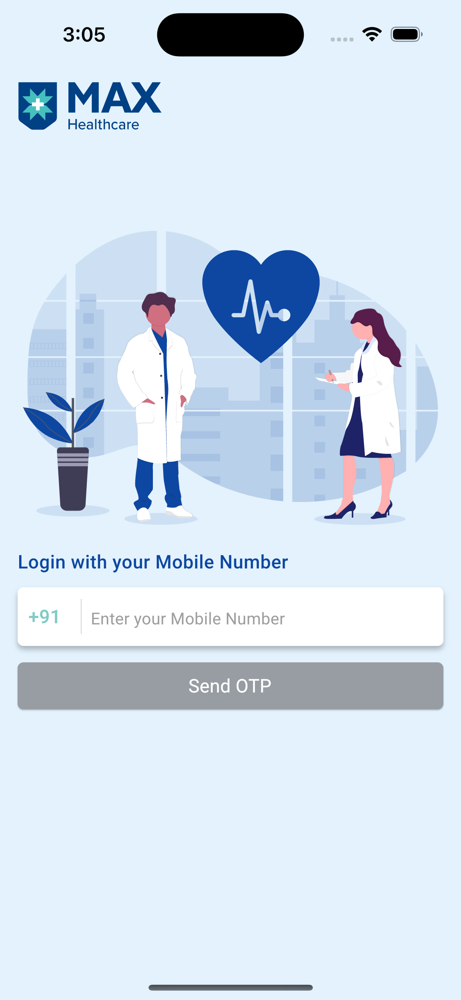
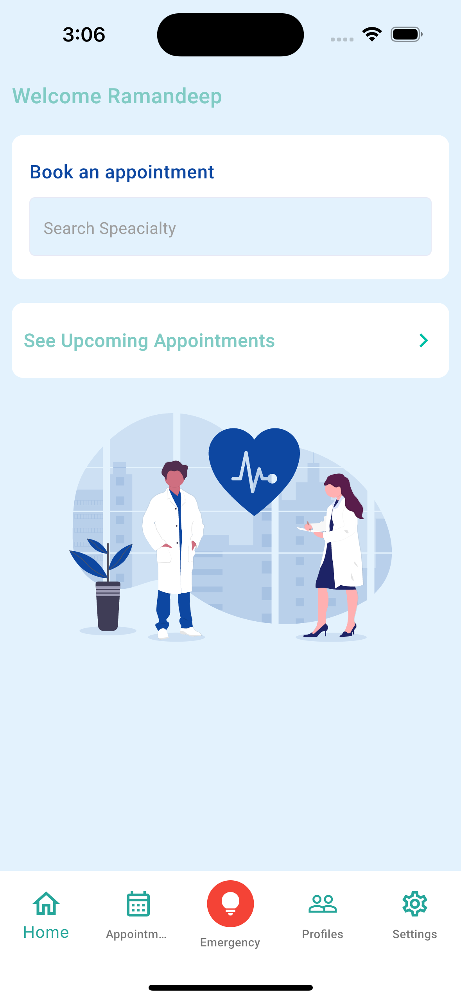
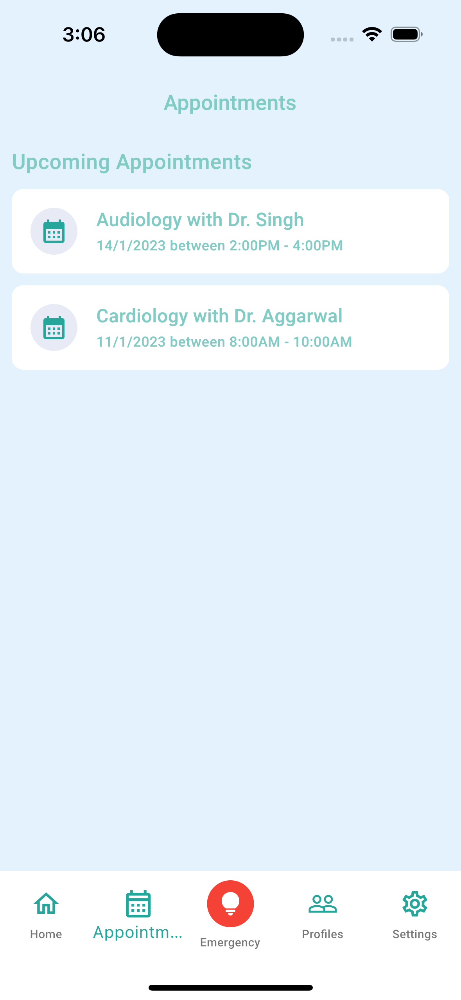
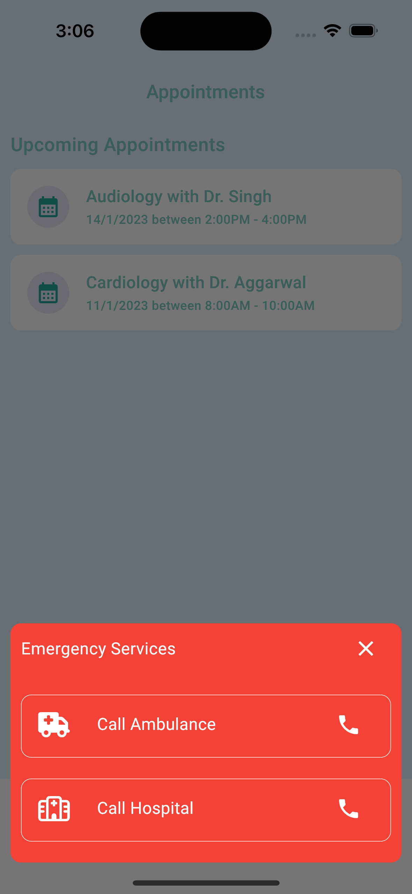
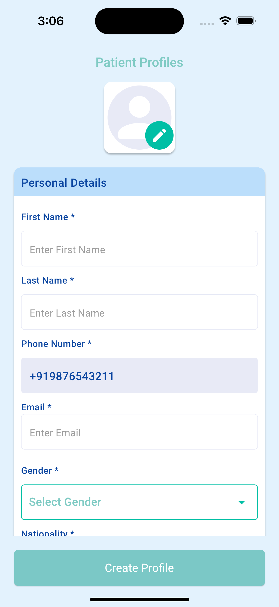
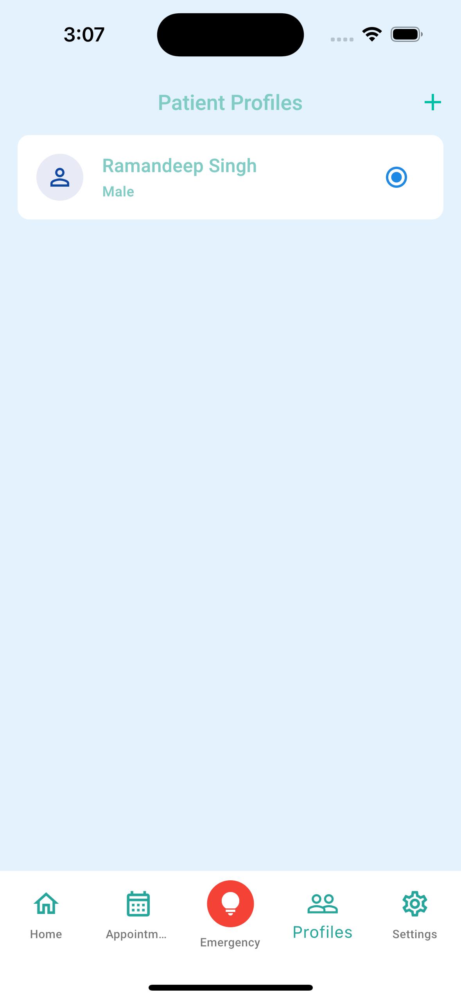
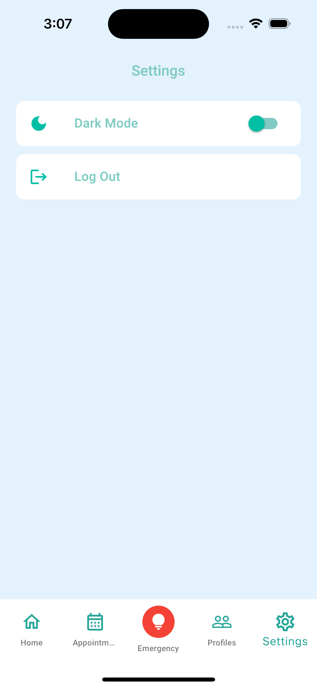

# health_app

This is a health app built using Flutter 3.0.0. It allows users to book an appointment throught the application along with ability to create multiple patient profiles.

## Getting Started

1. Install Flutter by following the instructions at https://docs.flutter.dev/development/tools/sdk/releases
2. Clone this repository
3. In the project directory, run `flutter pub get`
4. Run `flutter run` to start the app

## Packages Used
- `provider: ^6.0.5` for state management
- `pinput: ^2.2.21` for otp input
- `flutter_svg: ^1.1.6` for SVG images
- `font_awesome_flutter: ^10.3.0` for icons
- `firebase_core: ^2.4.1` for firebase core 
- `firebase_auth: ^4.2.5` for firebase auth
- `cloud_firestore: ^4.3.1` for firebase database
- `google_fonts: ^3.0.1` for fonts
- `shared_preferences: ^2.0.15` to persisit data
- `go_router: ^4.5.1` for routing
- `url_strategy: ^0.2.` to remove # from url
- `image_picker: ^0.8.` to pick images
- `table_calendar: ^3.0.8` for calendar
- `url_launcher: ^6.1.7` to open phone call app
- `uuid: ^3.0.7` for random id

## Screenshots

  

  

  
